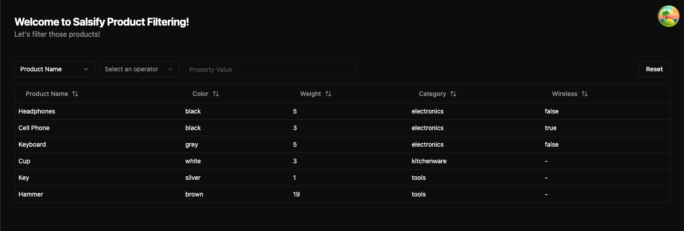
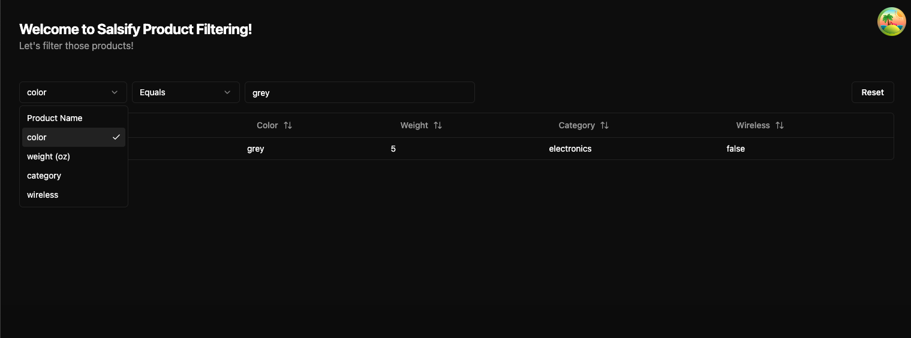
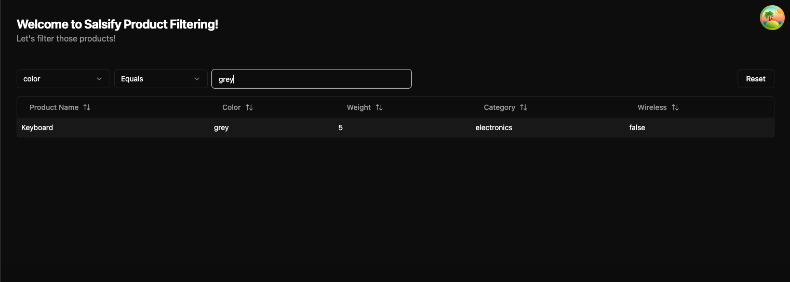

# Salsify Product Filter

> The code challenge for Salsify, a product filter using React 19, TypeScript, and Vite.

## 🚀 Live demo: [https://product-filtering.vercel.app/](https://product-filtering.vercel.app/)

## ✨ Tech Stack

- 🚀 **React 19** - Experience the future with the new React Compiler
- ⚡ **Vite** - Lightning-fast development with instant HMR
- 🎯 **TypeScript** - Type-safe development with latest features
- 🎨 **TailwindCSS** - Utility-first CSS with modern preset
- 🔄 **TanStack Router** - Type-safe routing with code splitting
- ✅ **Vitest** - Next-generation testing framework
- 📦 **PNPM** - Fast, disk space efficient package manager
- 🔍 **ESLint + Prettier** - Modern linting and code formatting
- 🪩 **chadcn** - A set of components for building beautiful UIs
- 🧪 **Testing Library** - Testing utilities for React

## 📚 Documentation

### Requirement

Latest LTS for node js, and pnpm installed.

### Getting Started

```bash
# Clone the repository
git clone https://github.com/claudiorodr/product-filtering

# Navigate to project directory
cd product-filtering

# Install dependencies
pnpm install

# Clean up git
pnpm node --experimental-strip-types ./scripts/setup.ts

# Start development server
pnpm dev
```

### Available Scripts

| Command             | Description                |
| ------------------- | -------------------------- |
| \`pnpm dev\`        | Start development server   |
| \`pnpm build\`      | Build for production       |
| \`pnpm preview\`    | Preview production build   |
| \`pnpm test\`       | Run tests                  |
| \`pnpm format\`     | Run Prettier over the code |
| \`pnpm lint\`       | Lint code                  |
| \`pnpm type-check\` | Check types                |

### Project Structure

```
.
├── eslint.config.js
├── index.html
├── LICENCE
├── lint-staged.config.js
├── package.json
├── pnpm-lock.yaml
├── postcss.config.js
├── public
│   ├── React-icon.svg
│   ├── tailwind.png
│   ├── tanstack.webp
│   ├── typescript.svg
│   └── vite.svg
├── README.md
├── scripts
│   └── setup.ts
├── src
│   ├── components
│   ├── main.tsx
│   ├── queries
│   ├── routes
│   ├── routeTree.gen.ts
│   ├── styles
│   └── vite-env.d.ts
├── tailwind.config.ts
├── tests
│   ├── setup.tsx
│   └── utils
├── tsconfig.app.json
├── tsconfig.json
├── tsconfig.node.json
└── vite.config.ts
```

### ℹ️ Product Details

In this project we build a product filter applies to the full set of products. The resulting set of products, presented as a list, is updated as filters are added or changed.

In order to create a filter users must choose a property, an operator, and one or more values. When the user selects a property, the available operators are updated to only show the operators that are valid for that property. If the operator allows to filter by property values then the search input is enabled, otherwise it stays disabled. It is possible to reset the filter by clicking on the "Reset" button.

The products table shows 5 columns: **Name**, **Color**, **Category**, **Weight** and **Category** and **Wireless**. The table is sortable by each of the columns. The table is paginated and shows 10 products per page. The user can navigate between pages using the pagination component.

### 📸 Screenshots





### Technical Details

The project has 2 main components: `ProductFilter` and `ProductTable`. The `ProductFilter` component is responsible for rendering the filter form and the `ProductTable` component is responsible for rendering the product table.

The `ProductFilter` component uses the `fetchProperties` and `fetchOperatorsByProperty` queries to fetch the operators by a given property.

The `ProductTable` component uses the `fetchProductsByFilters` query to fetch the products by the selected filters. On the first render, the `ProductTable` component fetches all the products and renders them in the table. The `fetchProductsByFilters` query is called whenever the filters are changed.

Tests are written using the `@testing-library/react` library. The tests are located in the `tests` folder. The tests are run using the `pnpm test` command. They replicate the user experience by simulating user interactions with the filter form and the product table.

---

<div align="center">

Made with ❤️ by Cláudio Rodrigues

</div>
